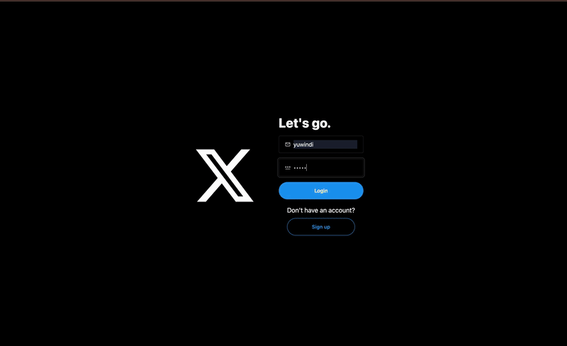

# Twitter Is Mine | Full-Stack Twitter Clone



## Features

- ⚛️ Tech Stack: React.js, MongoDB, Node.js, Express, Tailwind CSS
- 🔐 Authentication with JWT (JSON Web Tokens)
- 🔥 React Query for Data Fetching, Caching, and State Management
- 👥 Suggested Users to Follow
- ✍️ Creating Posts with Text and Images
- 🗑️ Deleting Posts (only by the owner)
- 💬 Commenting on Posts
- ❤️ Liking and Unliking Posts
- 📝 Edit Profile Information
- 🖼️ Edit Cover Image and Profile Image
- 📷 Image Uploads using Cloudinary
- 🔔 Notifications for New Followers and Likes
- 🌐 Production-ready Deployment Configuration

## About This Project

**Twitter Is Mine** is my personal implementation of a Twitter-like social platform using the MERN stack (MongoDB, Express, React, Node.js). I've built this application to demonstrate full-stack development skills including user authentication, real-time data updates, image uploading, and responsive UI design.

## Tech Stack

- Frontend: React.js, React Query, Tailwind CSS, DaisyUI
- Backend: Node.js, Express
- Database: MongoDB
- Authentication: JWT (JSON Web Tokens)
- Image Storage: Cloudinary
- Styling: Tailwind CSS with DaisyUI components

## Installation

### Prerequisites

- Node.js (v16 or higher)
- npm or yarn
- MongoDB Atlas account (or local MongoDB installation)
- Cloudinary account (for image uploads)

### Clone Repository

```bash
git clone https://github.com/Yuriowindiatmoko2401/twitter-is-mine.git
cd twitter-is-mine
```

### Install Dependencies

Install server dependencies:

```bash
npm install
```

Install client dependencies:

```bash
cd frontend
npm install
cd ..
```

## Configuration

### Setup Environment Variables

Create a `.env` file in the root directory with the following variables:

```
MONGO_URI=your_mongodb_connection_string
PORT=5001
JWT_SECRET=your_secure_jwt_secret
NODE_ENV=development
CLOUDINARY_CLOUD_NAME=your_cloudinary_cloud_name
CLOUDINARY_API_KEY=your_cloudinary_api_key
CLOUDINARY_API_SECRET=your_cloudinary_api_secret
```

- **MONGO_URI**: Your MongoDB connection string
- **PORT**: Server port (default: 5001)
- **JWT_SECRET**: Secret key for JWT token generation
- **NODE_ENV**: Environment setting (development/production)
- **CLOUDINARY_***: Your Cloudinary credentials for image uploading

## Running the Application

### Development Mode

Run both frontend and backend concurrently:

```bash
npm run dev
```

This will start:
- Backend server at http://localhost:5001
- Frontend dev server at http://localhost:5173

### Production Build

Create a production build:

```bash
npm run build
```

Start the production server:

```bash
npm start
```

## Project Structure

```
/
├── backend/                # Server-side code
│   ├── controllers/        # API controllers
│   ├── db/                 # Database connection
│   ├── lib/                # Utilities
│   ├── middleware/         # Express middleware
│   ├── models/             # Mongoose models
│   ├── routes/             # API routes
│   └── server.js           # Express server entry point
│
├── frontend/               # Client-side code
│   ├── public/             # Static files
│   └── src/                # React source code
│       ├── components/     # Reusable components
│       ├── hooks/          # Custom React hooks
│       ├── pages/          # Page components
│       └── utils/          # Utility functions
│
├── .env                    # Environment variables
├── package.json            # Project dependencies and scripts
└── README.md              # Project documentation
```

## API Endpoints

### Authentication
- `POST /api/auth/signup` - Register new user
- `POST /api/auth/login` - Authenticate user
- `POST /api/auth/logout` - Logout user
- `GET /api/auth/me` - Get current authenticated user

### Posts
- `GET /api/posts/all` - Get all posts
- `GET /api/posts/following` - Get posts from followed users
- `POST /api/posts/create` - Create a new post
- `POST /api/posts/like/:id` - Like/unlike a post
- `POST /api/posts/comment/:id` - Comment on a post
- `DELETE /api/posts/:id` - Delete a post

### Users
- `GET /api/users/profile/:username` - Get user profile
- `GET /api/users/suggested` - Get suggested users to follow
- `POST /api/users/follow/:id` - Follow/unfollow a user
- `POST /api/users/update` - Update user profile

## Troubleshooting

### Common Issues

1. **MongoDB Connection Error**
   - Verify your MongoDB URI is correct
   - Ensure network access is properly configured

2. **Image Upload Issues**
   - Check Cloudinary credentials
   - Verify image size limits (current limit: 5MB)

3. **CORS Errors in Development**
   - Make sure proxy setting is correct in frontend package.json

## License

Developed by Yurio Windiatmoko (Yuriowindiatmoko2401)

ISC
